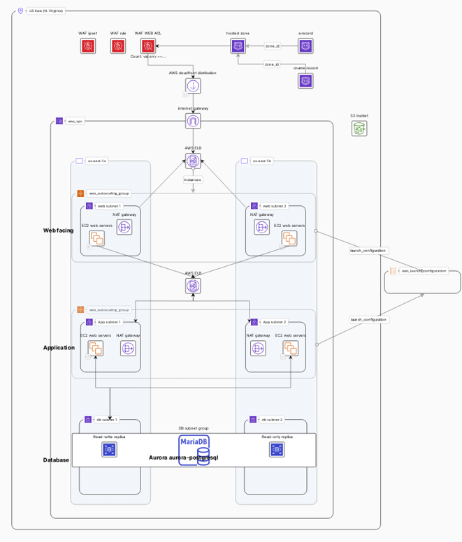

# Terraform Infrastructure Deployment

### Resources Overview

1. **Auto Scaling Groups**
   - Two Auto Scaling Groups named `asg-app` and `asg-web` are created for application and web instances, respectively. They scale between 1 to 3 instances and use ELB health checks.

2. **DB Subnet Group**
   - Managed by Terraform, this subnet group is for RDS instances with tags for environment and architecture.

3. **Elastic IPs (EIPs)**
   - Multiple Elastic IPs (`nat_eip_natgw`, `nat_eip_natgw_c`, `nat_eip_natgw_c_1_c`, `nat_eip_natgw_c_c`) are allocated for NAT gateways to provide static public IPs for outbound internet traffic.

4. **Elastic Load Balancer (ELB)**
   - An Elastic Load Balancer named `web-elb` distributes traffic among web instances. It listens on port 8080 (HTTP).

5. **Internet Gateway**
   - An Internet Gateway named `igw` connects the VPC to the internet.

6. **Launch Configuration**
   - A Launch Configuration is defined for app instances in the Auto Scaling Group with specifications such as instance type and image ID.

7. **NAT Gateways**
   - Multiple NAT Gateways (`natgw`, `natgw_c`, `natgw_c_1_c`, `natgw_c_c`) are created for private instances to access the internet while remaining private.

8. **RDS Clusters**
   - Two Aurora PostgreSQL RDS clusters (`aws_rds_cluster_prod_primary` and `aws_rds_cluster_prod_standby`) are provisioned in a multi-AZ setup.

9. **Security Groups**
   - A security group named `Demo Security Group` is created with ingress rules for SSH, HTTPS, and HTTP.

10. **Subnets**
    - Private Application Subnets (`app_a`, `app_b`), Private Database Subnets (`db_a`, `db_b`), and Public Web Subnets (`web_a`, `web_b`) are defined with their respective CIDR blocks.

11. **VPC**
    - A VPC named `vpc_prod` with a CIDR block of 10.0.0.0/16 is created, along with default security groups and route tables. It is tagged with environment and architecture identifiers.

12. **ACM**
    - This section outlines the configuration for managing SSL certificates using AWS Certificate Manager (ACM). It includes provisions for a wildcard SSL certificate, facilitating secure connections across various subdomains under the root domain. The process involves DNS validation for certificate issuance, managed by Route 53. The lifecycle management ensures seamless certificate updates without disrupting service availability.

### 1. AWS Auto Scaling Group (app) 🚀

- **Name**: "asg-app"
- **Capacity**: 1 to 3 instances
- **Health Check Type**: ELB
- **Metrics Granularity**: 1 minute
- **Description**: Auto Scaling Group for application instances with ELB health checks.

### 2. AWS Auto Scaling Group (web) 🚀

- **Name**: "asg-web"
- **Capacity**: 1 to 3 instances
- **Health Check Type**: ELB
- **Metrics Granularity**: 1 minute
- **Description**: Auto Scaling Group for web instances with ELB health checks.

### 3. AWS DB Subnet Group 🛢️

- **Description**: Managed by Terraform
- **Tags**: Environment: Development
- **Description**: Subnet group for RDS instances with tags for environment and architecture.

### 4. AWS Elastic IP (nat_eip_natgw) 🌐

- **VPC**: True
- **Description**: Elastic IP for NAT gateway to provide a static public IP for outbound internet traffic.

### 5. AWS Elastic IP (nat_eip_natgw_c) 🌐

- **VPC**: True
- **Description**: Elastic IP for another NAT gateway to provide a static public IP.

### 6. AWS Elastic IP (nat_eip_natgw_c_1_c) 🌐

- **VPC**: True
- **Description**: Elastic IP for another NAT gateway for redundancy.

### 7. AWS Elastic IP (nat_eip_natgw_c_c) 🌐

- **VPC**: True
- **Description**: Elastic IP for yet another NAT gateway for additional redundancy.

### 8. AWS Elastic Load Balancer (web) ⚖️

- **Name**: "web-elb"
- **Internal**: False
- **Listener Port/Protocol**: 8080 (HTTP)
- **Description**: Elastic Load Balancer for distributing traffic among web instances.

### 9. AWS Internet Gateway (igw) 🌐

- **Tags**: Environment: Development
- **Description**: Internet Gateway for connecting the VPC to the internet.

### 10. AWS Launch Configuration (app) 🚀

- **Instance Type**: t4g.nano
- **Image ID**: ami-0730971bf8e0532d6
- **Monitoring**: Enabled
- **Description**: Launch Configuration for app instances in the Auto Scaling Group.

### 11. AWS NAT Gateway (natgw) 🌐

- **Tags**: Environment: Development
- **Description**: NAT Gateway for private instances to access the internet while remaining private.

### 12. AWS NAT Gateway (natgw_c) 🌐

- **Tags**: Environment: Development
- **Description**: Another NAT Gateway for redundancy.

### 13. AWS NAT Gateway (natgw_c_1_c) 🌐

- **Tags**: Environment: Development
- **Description**: Additional NAT Gateway for further redundancy.

### 14. AWS NAT Gateway (natgw_c_c) 🌐

- **Tags**: Environment: Development
- **Description**: Yet another NAT Gateway for even more redundancy.

### 15. AWS RDS Cluster 1 (aws_rds_cluster_prod_primary)
- **Engine**: Aurora PostgreSQL
- **Engine Mode**: Provisioned
- **Master Username**: franroav
- **Storage Type**: [Type]
- **Backup Retention Period**: [Period]
- **Availability Zones**: us-east-1a, us-east-1b
- **Tags:**
  - "archuuid": "1d1c2826-1512-4de7-8248-e3db1517622c"
  - "env": "Development"

### 16. AWS RDS Cluster 2 (aws_rds_cluster_prod_standby)
- **Engine**: Aurora PostgreSQL
- **Engine Mode**: Provisioned
- **Master Username**: franroav
- **Storage Type**: [Type]
- **Backup Retention Period**: [Period]
- **Availability Zones**: us-east-1a, us-east-1b
- **Tags:**
  - "archuuid": "1d1c2826-1512-4de7-8248-e3db1517622c"
  - "env": "Development"

## 17. Security Groups

### 17. Demo Security Group (demosg1)
- **Description**: Demo Module
- **Ingress Rules:**
  - SSH (Port 22)
  - HTTPS (Port 443)
  - HTTP (Port 80)

## 18. Subnets
### Private Application Subnets
- **Subnet A (app_a):**
  - **CIDR Block**: 10.0.0.0/24
- **Subnet B (app_b):**
  - **CIDR Block**: 10.0.1.0/24

### Private Database Subnets
- **Subnet A (db_a):**
  - **CIDR Block**: 10.0.2.0/24
- **Subnet B (db_b):**
  - **CIDR Block**: 10.0.3.0/24

### Public Web Subnets
- **Subnet A (web_a):**
  - **CIDR Block**: 10.0.4.0/24
- **Subnet B (web_b):**
  - **CIDR Block**: 10.0.5.0/24

## 19. VPC
### VPC (vpc_prod)
- **CIDR Block**: 10.0.0.0/16
- **Default Security Group**: [ID]
- **Default Route Table**: [ID]
- **Tags:**
  - "archuuid": "1d1c2826-1512-4de7-8248-e3db1517622c"
  - "env": "Development"

## 20. ACM - SSL Certificate
- **Certificate**:
  - **Domain Name**: Provided root domain name
  - **Subject Alternative Names**: Wildcard domain for the root domain name
  - **Validation Method**: DNS
  - **Lifecycle**: Creates before destroying previous certificate if any
  
- **DNS Validation**:
  - Creates DNS records for certificate validation in Route 53
  - **Name**: Record name for DNS validation
  - **Record**: DNS record value for validation
  - **TTL**: Time to live for DNS record
  - **Type**: Record type for DNS record

  